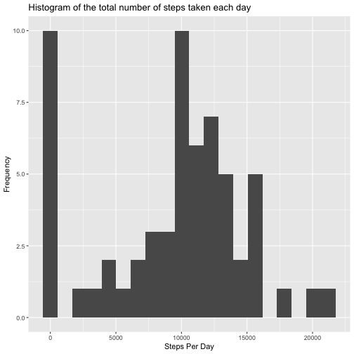
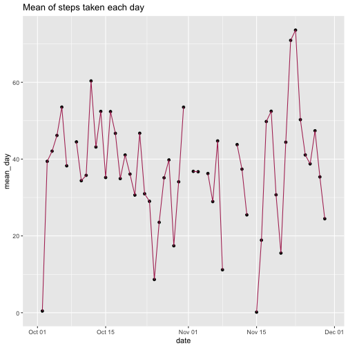
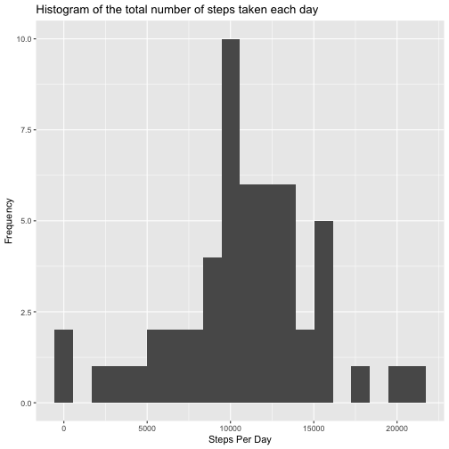
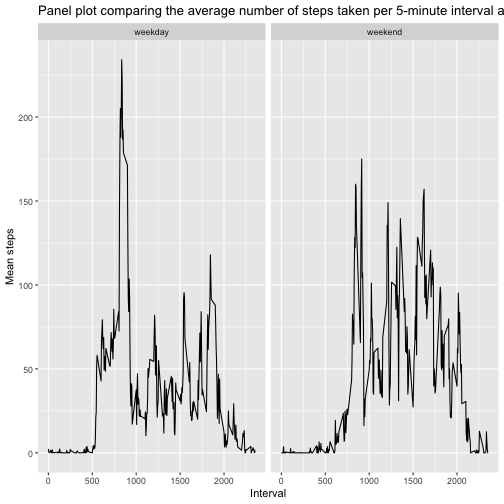

# Course project 1
===========================
Load libraries

```r
library(tidyverse)
library(ggplot2)
```
1. Code for reading in the dataset and/or processing the data

```r
activity<-read.table("activity.csv", header = TRUE, sep=",")
head(activity)
```

```
##   steps       date interval
## 1    NA 2012-10-01        0
## 2    NA 2012-10-01        5
## 3    NA 2012-10-01       10
## 4    NA 2012-10-01       15
## 5    NA 2012-10-01       20
## 6    NA 2012-10-01       25
```
2. Histogram of the total number of steps taken each day
Total steps for each day

```r
activity %>% group_by(date) %>% summarise(steps_day = sum(steps, na.rm = TRUE)) %>%  ggplot(aes(x = steps_day)) + geom_histogram(bins = 20) + ggtitle("Histogram of the total number of steps taken each day") + xlab("Steps Per Day") + ylab("Frequency")
```

```
## `summarise()` ungrouping output (override with `.groups` argument)
```



3. Mean and median number of steps taken each day
Mean number of steps taken each day

```r
mean_day<-activity %>% group_by(date) %>% summarise(mean_day = mean(steps, na.rm = TRUE))
```

```
## `summarise()` ungrouping output (override with `.groups` argument)
```
Mean of steps each day

```r
mean_day %>% summarise(total_mean = mean(mean_day, na.rm=TRUE))
```

```
## Warning: `...` is not empty.
## 
## We detected these problematic arguments:
## * `needs_dots`
## 
## These dots only exist to allow future extensions and should be empty.
## Did you misspecify an argument?
```

```
## # A tibble: 1 x 1
##   total_mean
##        <dbl>
## 1       37.4
```

Meadian number of steps taken each day

```r
median_day<-activity %>% group_by(date) %>% summarise(median_day = median(steps, na.rm = TRUE))
```

```
## `summarise()` ungrouping output (override with `.groups` argument)
```

Median of steps each day

```r
median_day %>% summarise(total_mean = mean(median_day, na.rm=TRUE))
```

```
## Warning: `...` is not empty.
## 
## We detected these problematic arguments:
## * `needs_dots`
## 
## These dots only exist to allow future extensions and should be empty.
## Did you misspecify an argument?
```

```
## # A tibble: 1 x 1
##   total_mean
##        <dbl>
## 1          0
```

4. Time series plot of the average number of steps taken

Change class date 

```r
z<-mean_day$date <- as.Date(mean_day$date)
mean_day<-mutate(mean_day, date=z)
```


```r
mean_day %>%  ggplot(aes(x = date, y = mean_day)) + geom_point() + geom_line(color="maroon") + ggtitle("Mean of steps taken each day") 
```

```
## Warning: Removed 8 rows containing missing values (geom_point).
```

```
## Warning: Removed 2 row(s) containing missing values (geom_path).
```



5.The 5-minute interval that, on average, contains the maximum number of steps
Group by interval, calculate mean of steps in each interval and filter by the max value of steps in the interval

```r
a<- activity %>% group_by(interval) %>% summarise(step_interval = mean(steps, na.rm = TRUE)) %>% filter(step_interval==max(step_interval))
```

```
## `summarise()` ungrouping output (override with `.groups` argument)
```

```r
print(a)
```

```
## Warning: `...` is not empty.
## 
## We detected these problematic arguments:
## * `needs_dots`
## 
## These dots only exist to allow future extensions and should be empty.
## Did you misspecify an argument?
```

```
## # A tibble: 1 x 2
##   interval step_interval
##      <int>         <dbl>
## 1      835          206.
```


```r
paste("The 5-minute interval that, on average, contains the maximum number of steps is", a$interval)
```

```
## [1] "The 5-minute interval that, on average, contains the maximum number of steps is 835"
```

6. Code to describe and show a strategy for imputing missing data
How many NA values are in the data

```r
sum(is.na(activity))
```

```
## [1] 2304
```

Import data eliminating missing values

```r
activity_no_NA <- activity[complete.cases(activity),]
```

Corroborate no NA values in activity_no_NA

```r
sum(is.na(activity_no_NA))
```

```
## [1] 0
```
7.Histogram of the total number of steps taken each day after missing values are imputed

```r
activity_no_NA %>% group_by(date) %>% summarise(steps_day = sum(steps, na.rm = TRUE)) %>%  ggplot(aes(x = steps_day)) + geom_histogram(bins = 20) + ggtitle("Histogram of the total number of steps taken each day") + xlab("Steps Per Day") + ylab("Frequency")
```

```
## `summarise()` ungrouping output (override with `.groups` argument)
```



8. Panel plot comparing the average number of steps taken per 5-minute interval across weekdays and weekends

Define day of the week

```r
y<-activity_no_NA%>%mutate(week = weekdays(as.Date(date)))
```

Define weekdays and weekends

```r
z<-mutate(y, weekday_weekend = ifelse(week=="Saturday"| week == "Sunday", "weekend", "weekday"))
```


```r
mean_interval<-z%>%group_by(weekday_weekend, interval)%>%summarise(mean_interval=mean(steps))
```

```
## `summarise()` regrouping output by 'weekday_weekend' (override with `.groups` argument)
```

```r
ggplot(mean_interval, aes(x=interval, y=mean_interval))+geom_line()+facet_wrap(~weekday_weekend)+ylab("Mean steps")+xlab("Interval")+ggtitle("Panel plot comparing the average number of steps taken per 5-minute interval across weekdays and weekends")
```




